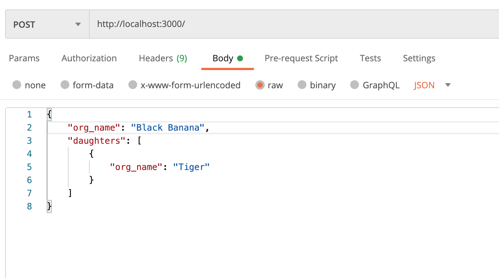
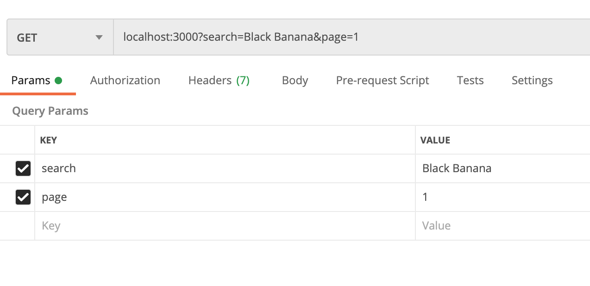
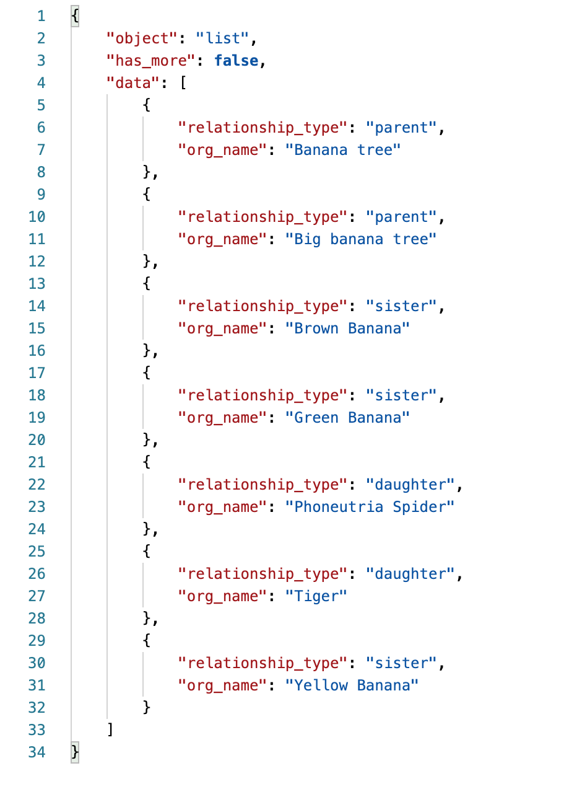

# Pipedrive Challenge

## Unit testing
In the terminal with the location on the root folder, run:

    npm test

## API Endpoints
In the terminal with the location on the root folder, run:

    npm start

If using nodemon, run:

    nodemon start

The API will be available here [http://locahost:3000/](http://locahost:3000/)

### Adding organizations and relations

To add organizations, the HTTP method is **POST** with a body such as the example given in the challenge:

### Getting organizations and relations

To get the relations of an organization, the HTTP method is **GET** and the query parameters _search_ and _page_. The _search_ parameter is the name of the organization to search, such as "Yellow Banana" or "Big Banana Tree", and the _page_ parameter states the page that the user wants to see. The limit of items per page is 100. An example follows:

The expected result is:

